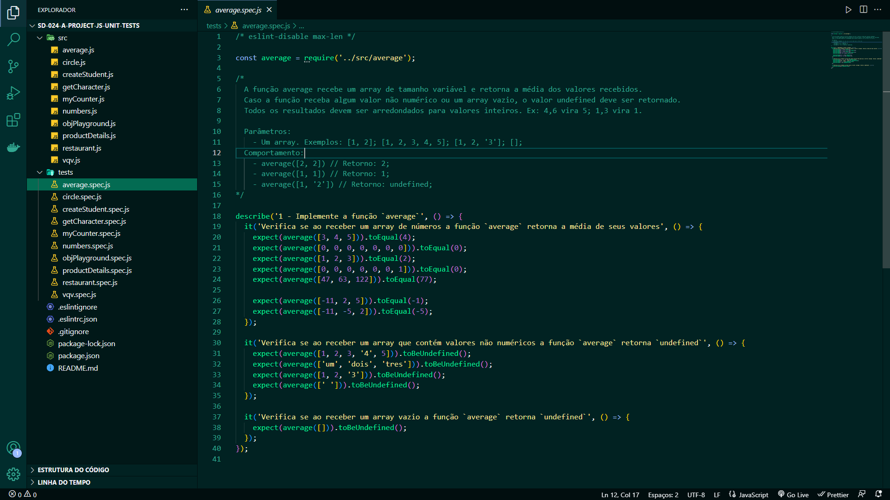

<h1 align="center">Projeto - JavaScript Teste Unitários</h1>
  

<strong>👨‍💻 O que foi desenvolvido</strong>
 

Implementei várias funções na resolução dos requisitos propostos e/ou testes unitários para garantir que as implementações das funções estão corretas, de acordo com o que está sendo solicitado em cada enunciado.

Nesse projeto, fui capaz de:

- Escrever testes unitários utilizando o módulo Jest do NodeJS para verificar o correto funcionamento das funções;
- Escrever funções de forma que elas atendam a testes já implementados;
- Escrever testes e funções utilizando uma abordagem de desenvolvimento orientado a testes.

 

